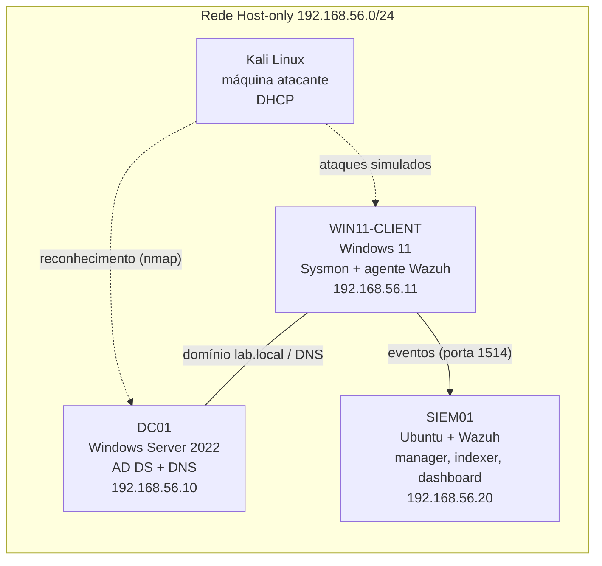

# 🛡️ Cybersecurity Journey

Diário técnico da minha transição para **Blue Team / SOC Analyst**: laboratório próprio de detecção, estudos semanais documentados e troubleshooting real, tudo com foco em evidências e comandos reproduzíveis.

> **Objetivo:** chegar a uma vaga júnior de SOC Analyst (N1) usando apenas recursos gratuitos, e provar o aprendizado com prática documentada.

---

## 🧪 Lab de Detecção

Ambiente 100% virtual (VirtualBox), isolado em rede **Host-only** (`192.168.56.0/24`), sem exposição à rede física.



| VM | Papel | IP | SO |
|---|---|---|---|
| DC01 | Domain Controller (`lab.local`) | 192.168.56.10 | Windows Server 2022 |
| WIN11-CLIENT | Cliente monitorado (Sysmon + agente Wazuh) | 192.168.56.11 | Windows 11 Enterprise Evaluation |
| SIEM01 | SIEM (Wazuh manager + indexer + dashboard) | 192.168.56.20 | Ubuntu Server 24.04 |
| Kali | Atacante (Red Team controlado) | DHCP | Kali Linux |

**Fluxo de detecção:** evento no Windows → Sysmon enriquece → agente Wazuh envia ao manager → indexer armazena → dashboard exibe alertas mapeados ao MITRE ATT&CK.

---

## 📚 Progresso — Fase 1: Fundamentos

| Semana | Tema | Destaque prático |
|---|---|---|
| [01](teoria/Semana-01.md) | Modelo OSI | Alerta 4625 (falha de logon) capturado e interpretado no Wazuh; troubleshooting de autenticação no indexer |
| [02](teoria/Semana-02.md) | Endereçamento IP e subnetting | Cálculo de sub-redes aplicado ao plano de endereçamento do lab |
| [03](teoria/Semana-03.md) | DNS, DHCP e protocolos | Troubleshooting de DNS com duas causas raiz, resolvido com captura de pacotes |
| 04 | Portas, TCP/UDP, firewalls e NAT | 🔄 em andamento |
| 05–12 | Linux, AD, Event Logs, SIEM/SOC | ⏳ planejado |

---

## 🗂️ Estrutura do repositório

```
├── teoria/           # notas semanais + exercícios no lab
├── lab-setup/        # arquitetura e passo a passo da montagem
└── blue-team-writeups/   # investigações de alertas e casos de troubleshooting
```

## 🧭 Roadmap

1. **Fase 1 — Fundamentos** (redes, Linux, Windows/AD, conceitos de segurança) ← *estou aqui*
2. **Fase 2 — Detecção e SIEM** (Wazuh a fundo, regras customizadas, análise de logs)
3. **Fase 3 — Prática ofensiva controlada** (ataques do Kali contra o próprio lab, observando a detecção)
4. **Fase 4 — CTFs e portfólio** (writeups com seção "como isso apareceria no SIEM")

## ⚠️ Aviso

Todos os testes ofensivos são executados exclusivamente contra VMs próprias, em rede isolada. Nenhuma credencial real é publicada neste repositório (senhas aparecem como `<senha>`).
